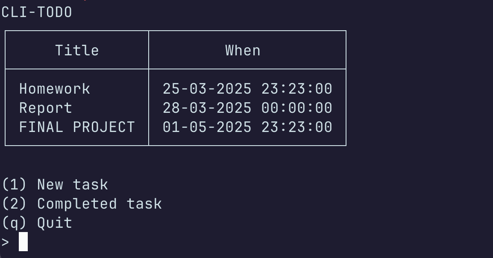

# todo

CLI - Todo App



## Installation

Install Crystal compiler and compile program

```
shards install
crystal build src/Todo.cr
```

## Usage

Used as any CLI application.

Writes to `home/<user>/.config/TodoApp/` so make sure
make sure its not being used by another app.

## Todo

I originally created this for organizing my self but
then I discovered Obsidian. I much rather use Obsidian
but decided it would be a waste to not to atleast finish
what I started.

I had so many features in mind when I first started.
